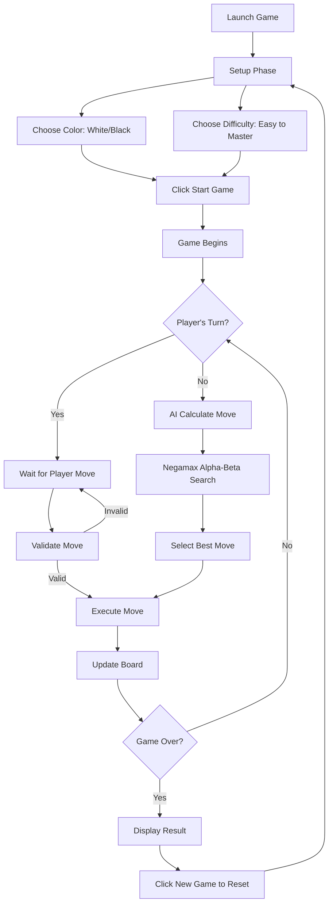
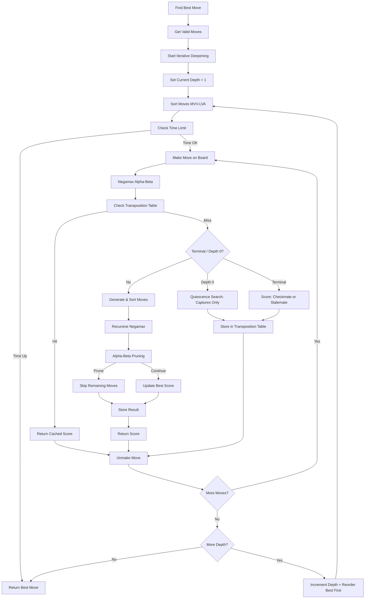
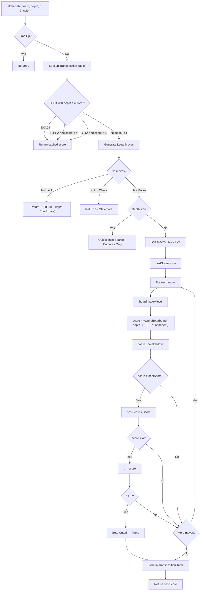

# Chess Game - Player vs Computer

A Java-based chess game featuring a sophisticated AI opponent with advanced search algorithms and optimization techniques.

## 🎮 Features

### Game Features
- **Complete Chess Rules**: All standard chess rules implemented
- **Visual Interface**: Clean, intuitive GUI with piece highlighting
- **Move Validation**: Real-time move validation and legal move highlighting
- **Game State Detection**: Checkmate, stalemate, and draw detection
- **Difficulty Levels**: 5 difficulty levels (Easy to Master)
- **Color Selection**: Choose to play as White or Black
- **One-Time Setup**: Color and difficulty locked once game starts
- **Castling**: Full castling support (kingside and queenside) with clear visual indicators
- **Pawn Promotion**: Promotion dialog for human players; AI evaluates all promotion options
- **En Passant**: Full en passant capture implementation with visual indicators

### AI Features
- **Negamax Alpha-Beta Pruning**: Efficient search tree exploration using the negamax framework
- **Zobrist Hashing**: Incrementally-updated position hashing for fast, collision-resistant transposition table lookups
- **Transposition Table**: Fixed-size array-based cache (~1M entries) with full hash verification and depth-preferred replacement
- **Iterative Deepening**: Progressive search with time management and best-move-first reordering
- **Quiescence Search**: Continues searching captures at leaf nodes to avoid the horizon effect
- **MVV-LVA Move Ordering**: Sorts moves at every search node (Most Valuable Victim – Least Valuable Attacker) for better pruning
- **Per-Piece Move Generation**: Generates destinations per piece type (ray-casting for sliders, offset tables for knights/kings) instead of brute-forcing all 64 target squares
- **Make/Unmake Pattern**: Zero-allocation move execution with full state restoration, eliminating deep copies during search
- **Comprehensive Evaluation**: Material, positional (piece-square tables), king safety (pawn shield, check penalty), and mobility assessment

## 🏗️ Architecture

### File Structure

```
chess/
├── ChessGame.java      # Main GUI and game controller
├── ChessBoard.java     # Board state, move validation, make/unmake, Zobrist hashing
├── ChessAI.java        # AI engine: negamax, transposition table, quiescence search
├── ChessPiece.java     # Immutable piece representation (type + color + symbol)
├── Move.java           # Move representation (from/to, promotion, en passant flag)
├── PieceColor.java     # Enum: WHITE, BLACK with opposite() helper
├── PieceType.java      # Enum: KING, QUEEN, ROOK, BISHOP, KNIGHT, PAWN
└── README.md           # This file
```

### Key Components

#### 1. ChessGame (GUI Controller)
- Manages the Swing graphical interface
- Handles user interactions and click-based move input
- Coordinates game flow between player and AI
- Displays game status, legal move highlights, and controls

#### 2. ChessBoard (Game Logic)
- 8×8 array board representation with cached king positions
- Per-piece legal move generation (pawn, knight, sliding, king)
- Make/unmake move pattern with `UndoInfo` for zero-allocation search
- Zobrist hash maintained incrementally across make/unmake
- Full rule enforcement: castling, en passant, promotion, check/checkmate/stalemate/draw

#### 3. ChessAI (AI Engine)
- Negamax alpha-beta search with iterative deepening
- Array-based transposition table with full hash key verification
- Quiescence search for captures at leaf nodes
- MVV-LVA move ordering at every node
- Multi-factor evaluation: material, piece-square bonuses, king safety, mobility

## 🔄 Game Flow


```mermaid
flowchart TD
    A[Launch Game] --> B[Setup Phase]
    B --> C[Choose Color: White/Black]
    B --> D[Choose Difficulty: Easy to Master]
    C --> E[Click Start Game]
    D --> E
    E --> F[Game Begins]
    F --> G{Player's Turn?}
    G -->|Yes| H[Wait for Player Move]
    G -->|No| I[AI Calculate Move]
    H --> J[Validate Move]
    J -->|Invalid| H
    J -->|Valid| K[Execute Move]
    I --> L[Negamax Alpha-Beta Search]
    L --> M[Select Best Move]
    M --> K
    K --> N[Update Board]
    N --> O{Game Over?}
    O -->|No| G
    O -->|Yes| P[Display Result]
    P --> Q[Click New Game to Reset]
    Q --> B
```

## 🧠 AI Algorithm Flow


```mermaid
flowchart TD
    A[Find Best Move] --> C[Get Valid Moves]
    C --> D[Start Iterative Deepening]
    D --> E[Set Current Depth = 1]
    E --> F[Sort Moves MVV-LVA]
    F --> G[Check Time Limit]
    G -->|Time Up| H[Return Best Move]
    G -->|Time OK| I[Make Move on Board]
    I --> J[Negamax Alpha-Beta]
    J --> K[Check Transposition Table]
    K -->|Hit| L[Return Cached Score]
    K -->|Miss| M{Terminal / Depth 0?}
    M -->|Depth 0| Q[Quiescence Search: Captures Only]
    M -->|Terminal| N[Score: Checkmate or Stalemate]
    M -->|No| O[Generate & Sort Moves]
    Q --> P[Store in Transposition Table]
    N --> P
    O --> R[Recursive Negamax]
    R --> S[Alpha-Beta Pruning]
    S -->|Prune| T[Skip Remaining Moves]
    S -->|Continue| U[Update Best Score]
    T --> V[Store Result]
    U --> V
    V --> W[Return Score]
    L --> X[Unmake Move]
    W --> X
    P --> X
    X --> Y{More Moves?}
    Y -->|Yes| I
    Y -->|No| Z{More Depth?}
    Z -->|Yes| AA[Increment Depth + Reorder Best First]
    AA --> F
    Z -->|No| H
```

## 🔍 Negamax Alpha-Beta


```mermaid
flowchart TD
    A["alphaBeta(board, depth, α, β, color)"] --> B{Time Up?}
    B -->|Yes| C[Return 0]
    B -->|No| D[Lookup Transposition Table]
    D --> E{TT Hit with depth ≥ current?}
    E -->|EXACT| F[Return cached score]
    E -->|ALPHA and score ≤ α| F
    E -->|BETA and score ≥ β| F
    E -->|No useful hit| G[Generate Legal Moves]
    G --> H{No moves?}
    H -->|In Check| I["Return −100000 − depth (Checkmate)"]
    H -->|Not in Check| J[Return 0 - Stalemate]
    H -->|Has Moves| K{Depth ≤ 0?}
    K -->|Yes| L[Quiescence Search - Captures Only]
    K -->|No| M[Sort Moves - MVV-LVA]
    M --> N[bestScore = −∞]
    N --> O[For each move]
    O --> P[board.makeMove]
    P --> Q["score = −alphaBeta(board, depth−1, −β, −α, opponent)"]
    Q --> R[board.unmakeMove]
    R --> S{score > bestScore?}
    S -->|Yes| T[bestScore = score]
    S -->|No| U{More moves?}
    T --> V{score > α?}
    V -->|Yes| W[α = score]
    V -->|No| U
    W --> X{α ≥ β?}
    X -->|Yes| Y[Beta Cutoff — Prune]
    X -->|No| U
    U -->|Yes| O
    U -->|No| Z[Store in Transposition Table]
    Y --> Z
    Z --> AA[Return bestScore]
```

## 🎯 Position Evaluation

The AI evaluates positions using multiple factors:

### Material Evaluation
| Piece | Value |
|-------|-------|
| Pawn | 100 |
| Knight | 320 |
| Bishop | 330 |
| Rook | 500 |
| Queen | 900 |
| King | 20,000 |

### Positional Bonuses
- **Pawns**: Center control (+10), advancement (+5 per rank)
- **Knights**: Center control (+20), edge penalty (-10)
- **Bishops**: Long diagonals (+15), center control (+10)
- **Rooks**: Seventh rank attack (+15)
- **Queens**: Center control (+10)
- **Kings**: Safety near back rank (+20), center files (+10)

### Additional Factors
- **King Safety**: Check penalty (-50), pawn shield (+10 per shielding pawn)
- **Mobility**: Pseudo-legal move count difference (own vs opponent)

## 🚀 Performance Optimizations

### 1. Negamax Alpha-Beta Pruning
- Reduces search space by eliminating branches that can't affect the result
- Cleaner than separate min/max — single recursive call with sign negation
- Typical reduction: 50–90% fewer nodes evaluated

### 2. Zobrist Hashing & Transposition Table
- `long[2][6][64]` random number table initialized at class load
- Hash incrementally updated in make/unmake — no recomputation
- Fixed-size array table (~1M entries) indexed by `hash & mask`
- Full hash key stored per entry to detect collisions
- Depth-preferred replacement scheme

### 3. Quiescence Search
- At depth 0, continues searching capture moves only (up to 4 plies)
- Prevents the **horizon effect** — AI won't miss recaptures just past its search depth
- Stand-pat evaluation allows early cutoff when position is already good

### 4. Make/Unmake Pattern
- `makeMove()` returns `UndoInfo` capturing all prior state
- `unmakeMove()` restores the board perfectly — zero object allocation per node
- Eliminates millions of `board.clone()` calls and GC pressure during deep searches

### 5. Per-Piece Move Generation
- Pawns: 2–4 candidate squares instead of 64
- Knights: exactly 8 offset checks
- Sliding pieces: ray-cast until blocked
- ~10–50× fewer candidates than brute-force 64² scanning

### 6. Iterative Deepening with Move Reordering
- Starts shallow, progressively deepens within time limit
- Best move from previous iteration searched first in next iteration
- Provides good moves quickly while allowing deeper analysis

### 7. MVV-LVA Move Ordering
- Captures sorted by Most Valuable Victim – Least Valuable Attacker
- Applied at every node in the search tree, not just the root
- Dramatically improves alpha-beta cutoff rates

### 8. Time Management
- 5-second time limit per move
- Checked at every node — graceful degradation when time runs out

## 🎮 How to Play

### Starting the Game
1. **Compile**: `javac *.java`
2. **Run**: `java ChessGame`
3. **Choose Color**: Select "White" or "Black" from the dropdown
4. **Choose Difficulty**: Select from Easy (1) to Master (5)
5. **Click "Start Game"**: Begin the chess match

### Color Selection
- **White**: Play as White pieces (bottom), move first (traditional)
- **Black**: Play as Black pieces (top), AI moves first
- **Locked Choice**: Color cannot be changed once game starts

### Making Moves
1. **Click** on a piece to select it
2. **Valid moves** will be highlighted:
   - 🟢 Green: Regular moves
   - 🔴 Red: Capture moves
   - 🔵 Blue: Castling moves
   - 🟡 Gold: Pawn promotion moves
   - 🟠 Orange: En passant captures
3. **Click** on a highlighted square to make the move

### Special Moves

#### Castling
- **Kingside (O-O)**: King moves 2 squares toward h-file; rook jumps to other side
- **Queenside (O-O-O)**: King moves 2 squares toward a-file; rook jumps to other side
- **Requirements**: Neither king nor rook has moved, no pieces between them, king not in/through check

#### Pawn Promotion
When a pawn reaches the back rank, a dialog lets you choose: Queen, Rook, Bishop, or Knight.

#### En Passant
When a pawn advances two squares past an enemy pawn, the enemy can capture it on the next move as if it had only moved one square. Highlighted in orange.

### Difficulty Levels
| Level | Depth | Description |
|-------|-------|-------------|
| Easy (1) | 1 | Good for beginners |
| Medium (2) | 2 | Balanced challenge |
| Hard (3) | 3 | Default setting |
| Expert (4) | 4 | Advanced play |
| Master (5) | 5 | Maximum challenge |

## 🔧 Technical Details

### Search Algorithm
- **Algorithm**: Negamax with Alpha-Beta pruning + Quiescence search
- **Search Depth**: 1–5 plies (configurable) with iterative deepening up to 8
- **Time Limit**: 5 seconds per move
- **Transposition Table**: ~1M entry fixed-size array with Zobrist hashing

### Compatibility
- **Java Version**: 8 or higher
- **Dependencies**: Standard Java Swing (no external libraries)
- **Platform**: Cross-platform (Windows, macOS, Linux)

## 🎯 Future Enhancements

### Potential Improvements
1. **Opening Book**: Pre-computed opening moves
2. **Endgame Tables**: Specialized endgame evaluation
3. **Multi-threading**: Parallel search for better performance
4. **Network Play**: Player vs Player over network
5. **Move History**: Game replay and analysis features
6. **Custom Themes**: Different board and piece styles

### AI Enhancements
1. **Null Move Pruning**: Additional pruning technique
2. **Late Move Reductions**: Reduce depth for unlikely moves
3. **Killer Move Heuristic**: Remember refutation moves
4. **Aspiration Windows**: Narrow alpha-beta window for iterative deepening

## 🤝 Contributing

Contributions are welcome! Please feel free to submit pull requests or open issues for bugs and feature requests.

---

## Author
John Morfidis