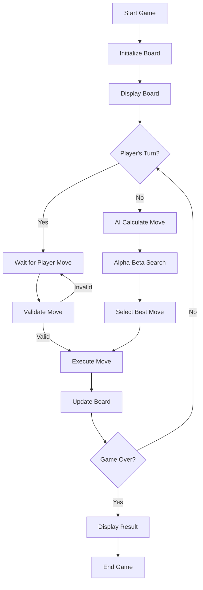

# Chess Game - Player vs Computer

A Java-based chess game featuring a sophisticated AI opponent with advanced search algorithms and optimization techniques.

## 🎮 Features

### Game Features
- **Complete Chess Rules**: All standard chess rules implemented
- **Visual Interface**: Clean, intuitive GUI with piece highlighting
- **Move Validation**: Real-time move validation and legal move highlighting
- **Game State Detection**: Checkmate, stalemate, and draw detection
- **Difficulty Levels**: 5 difficulty levels (Easy to Master)

### AI Features
- **Alpha-Beta Pruning**: Efficient search tree exploration
- **Transposition Table**: Caches evaluated positions for performance
- **Iterative Deepening**: Progressive search with time management
- **Move Ordering**: Intelligent move prioritization for better pruning
- **Comprehensive Evaluation**: Material, positional, king safety, and mobility assessment

## 🏗️ Architecture

### Core Classes

```
ChessGame.java          - Main GUI and game controller
├── ChessBoard.java     - Board representation and game logic
├── ChessAI.java        - AI engine with advanced algorithms
├── ChessPiece.java     - Piece representation and behavior
```

### Key Components

#### 1. ChessGame (GUI Controller)
- Manages the graphical interface
- Handles user interactions
- Coordinates game flow
- Displays game status and controls

#### 2. ChessBoard (Game Logic)
- Board state representation
- Move validation and execution
- Game state detection (checkmate, draw, etc.)
- Legal move generation

#### 3. ChessAI (AI Engine)
- Advanced search algorithms
- Position evaluation
- Move selection and optimization
- Performance monitoring

## 🔄 Game Flow



## 🧠 AI Algorithm Flow


## 🔍 Alpha-Beta Pruning


## 📊 Transposition Table


## 🎯 Position Evaluation

The AI evaluates positions using multiple factors:

### Material Evaluation
- **Pawn**: 100 points
- **Knight**: 320 points
- **Bishop**: 330 points
- **Rook**: 500 points
- **Queen**: 900 points
- **King**: 20,000 points

### Positional Bonuses
- **Pawns**: Center control (+10), advancement (+5 per rank)
- **Knights**: Center control (+20), edge penalty (-10)
- **Bishops**: Long diagonals (+15), center control (+10)
- **Rooks**: Seventh rank attack (+15)
- **Queens**: Center control (+10), early development (+5)
- **Kings**: Safety (+20), center files (+10)

### Additional Factors
- **King Safety**: Attack detection (-50), pawn shield (+10), mobility (+5 per move)
- **Mobility**: Legal moves bonus (+2 per move)

## 🚀 Performance Optimizations

### 1. Alpha-Beta Pruning
- Reduces search space by eliminating irrelevant branches
- Typical reduction: 50-90% fewer nodes evaluated

### 2. Transposition Table
- Caches evaluated positions to avoid re-computation
- Memory-efficient with size limits and cleanup

### 3. Iterative Deepening
- Starts with shallow searches and progressively deepens
- Provides good moves quickly while allowing time for deeper analysis
- Respects time limits for responsive gameplay

### 4. Move Ordering
- Prioritizes promising moves (captures, center control)
- Improves pruning efficiency by exploring good moves first

### 5. Time Management
- 5-second time limit per move
- Graceful degradation when time runs out

## 🎮 How to Play

### Starting the Game
1. Run `ChessGame.java`
2. You play as **White** (bottom pieces)
3. Computer plays as **Black** (top pieces)

### Making Moves
1. **Click** on a piece to select it
2. **Valid moves** will be highlighted:
   - 🟢 Green: Regular moves
   - 🔴 Red: Capture moves
3. **Click** on a highlighted square to make the move

### Difficulty Levels
- **Easy (1)**: Depth 1 - Good for beginners
- **Medium (2)**: Depth 2 - Balanced challenge
- **Hard (3)**: Depth 3 - Default setting
- **Expert (4)**: Depth 4 - Advanced play
- **Master (5)**: Depth 5 - Maximum challenge

### Game Controls
- **New Game**: Reset the board and start over
- **Difficulty**: Adjust AI strength before or during play

## 📁 File Structure

```
chess/
├── ChessGame.java      # Main game interface
├── ChessBoard.java     # Board logic and rules
├── ChessAI.java        # AI engine
├── README.md          # This file
```

## 🔧 Technical Details

### Search Algorithm
- **Algorithm**: Minimax with Alpha-Beta pruning
- **Search Depth**: 1-5 plies (configurable)
- **Time Limit**: 5 seconds per move
- **Memory Management**: 1M entry transposition table limit

### Performance Characteristics
- **Typical Move Time**: 1-3 seconds
- **Memory Usage**: ~50-100MB
- **Search Efficiency**: 10,000-100,000 nodes/second

### Compatibility
- **Java Version**: 8 or higher
- **Dependencies**: Standard Java Swing (no external libraries)
- **Platform**: Cross-platform (Windows, macOS, Linux)

## 🎯 Future Enhancements

### Potential Improvements
1. **Opening Book**: Pre-computed opening moves
2. **Endgame Database**: Specialized endgame evaluation
3. **Multi-threading**: Parallel search for better performance
4. **Network Play**: Player vs Player over network
5. **Move History**: Game replay and analysis features
6. **Custom Themes**: Different board and piece styles

### AI Enhancements
1. **Neural Network**: Machine learning-based evaluation
2. **Monte Carlo Tree Search**: Alternative search algorithm
3. **Quiescence Search**: Tactical position analysis
4. **Null Move Pruning**: Additional pruning technique

## 🤝 Contributing

Contributions are welcome! Please feel free to submit pull requests or open issues for bugs and feature requests.

---

## Author
John Morfidis 